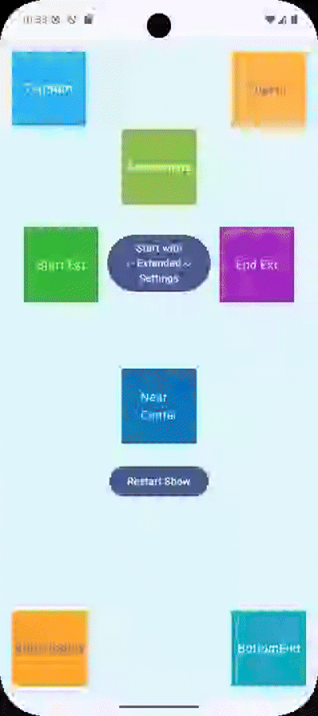

# TAO Bubbles (for Jetpack Compose)
=====================

A lightweight Jetpack Compose library for displaying customizable "bubbles", "showcases" or "tooltips" that can point to specific UI elements. 
This is useful for tutorials, feature highlights, or contextual help.

## Features

*   **Customizable Appearance**: Control arrow position, size, corner radius, colors, borders, and more.  You can easily adapt the style of your tooltips to match your app's design.
*   **Flexible Positioning**: Bubbles can point to any side of a target composable (`LEFT`, `RIGHT`, `TOP`, `BOTTOM`).
*   **Screen Boundary Awareness**: Bubbles automatically adjust their position to stay within screen bounds, ensuring a great user experience on any device.
*   **Sequential Display**: Use `BubbleShowController` to easily display a series of bubbles one by one, guiding the user through multiple steps.
*   **Enter/Exit Animations**: Smooth and customizable animations for bubble appearance and disappearance make interactions more dynamic.
*   **Scrim Background**: An optional scrim layer dims the background, helping to focus the user's attention on the bubble.
*   **Declarative API**: Built with Jetpack Compose for a modern Android UI, offering a simple and intuitive API.
*   **Easy to use**: No complicated constructions. Adding to an existing project is very simple.

[Download the latest release and demo](https://github.com/lordtao/android-tao-bubbles/releases)

[Licence](https://opensource.org/license/mit)




**Example Usage (Single Bubble):**

Create common bubble/s settings:

```kotlin
val testSettings = BubblesSettings(
        scrimColor = Color(0x22002EFF),
        backgroundColor = OrangeVeryLight,
        bubbleBorderColor = Color.Black,
        bubbleBorderWidth = 2.dp
    )
```

Prepare your bubble content:

```kotlin
val bubbleData = BubbleData(
    id = "Bubble id", // Must be unique for save the bubble state - shown or no
    arrowPosition = ArrowPosition.BOTTOM,
    content = { onDismissClick, onStopShowRequest ->
        // any composable content inside the Bubble
    }
)
```
Use in your code

```kotlin

@Composable
fun SingleBubbleExample() {
    var showBubble by remember { mutableStateOf(false) }
    var targetRect by remember { mutableStateOf<Rect?>(null) }

    Box(modifier = Modifier.fillMaxSize()) {
        Button(
            onClick = { showBubble = !showBubble },
            modifier = Modifier
                .align(Alignment.Center)
                .onGloballyPositioned { coordinates ->
                    targetRect = coordinates.boundsInWindow() // Get target component Rect
                }
        ) {
            Text("Show Bubble")
        }

        if (showBubble && targetRect != null) {
            Bubble(
                targetComponentRect = targetRect,
                bubbleData = bubbleData,
                settings = testSettings,
                isVisible = showBubble,
                onDismissRequest = { showBubble = false }
            )
        }
    }
}

```

**Example Usage (Sequence of Bubbles):**

Use `BubbleShowController` to manages the display of a sequence of bubbles (Bubbles show).

**Key Features:**

*   Maintains a queue of `BubbleData`.
*   Shows bubbles one by one.
*   Handles dismissal and advancing to the next bubble.
*   Cancel all shows.

Prepare your bubble content:

```kotlin
val testBubbles = listOf(
    BubbleData(
        id = "Bubble 1",
        arrowPosition = ArrowPosition.BOTTOM,
        content = { onDismissClick, onStopShowRequest ->
            // any composable content inside the Bubble
            MyContent("Bubble 1", onDismissClick, onStopShowRequest)
        }
    ),
    BubbleData(
        id = "Bubble 2",
        arrowPosition = ArrowPosition.LEFT,
        content = { onDismissClick, onStopShowRequest ->
            // any composable content inside the Bubble
            MyContent("Bubble 2", onDismissClick, onStopShowRequest)
        }
    ),
    BubbleData(
        id = "Bubble 3",
        arrowPosition = ArrowPosition.RIGHT,
        content = { onDismissClick, onStopShowRequest ->
            // any composable content inside the Bubble
            MyContent("Bubble 3", onDismissClick, onStopShowRequest)
        }
    )
)
```
Use in your code

```kotlin
@Composable
fun BubbleSequenceExample() {

    // Bubbles show preparing
    val bubblesSettings = remember { testSettings }
    val bubblesData = remember { testBubbles }
    val bubbleShowController = rememberBubbleShowController(
        settings = bubblesSettings,
        bubbles = bubblesData,
        onFinished = {
            // Actions to perform after all bubbles are completed
            Log.d("All bubbles completed")
        }
    )

    // Your UI
    Box(
        modifier = Modifier
            .fillMaxSize()
            .background(Color(0xFFE0F7FA))
    ) {

        // Differently positioned UI components

        Box(
            modifier = Modifier
                .align(Alignment.TopStart)
                .padding(16.dp)
                .size(100.dp)
                // Transferring data about this component to the controller and
                // associating it with a key from the pre-initialized BubbleData data
                .assignBubble(controller = bubbleShowController, bubbleData = bubblesData[0]),
            contentAlignment = Alignment.Center
        ) {
            Text("TopStart", color = Color.White)
        }

        Box(
            modifier = Modifier
                .align(Alignment.TopEnd)
                .padding(16.dp)
                .size(100.dp)
                .assignBubble(controller = bubbleShowController, bubbleData = bubblesData[1]),
            contentAlignment = Alignment.Center
        ) {
            Text("TopEnd", color = Purple40)
        }

        Box(
            modifier = Modifier
                .align(Alignment.BottomStart)
                .padding(16.dp)
                .size(100.dp)
                .assignBubble(controller = bubbleShowController, bubbleData = bubblesData[2]),
            contentAlignment = Alignment.Center
        ) {
            Text("BottomStart", color = Purple40)
        }
        
        // Restart show button
        
        Button(
            modifier = Modifier
                .align(Alignment.Center)
                .padding(top = 224.dp),
            onClick = {
                bubbleShowController.restartShow()
            }) {
            Text("Restart Show", color = Color.White)
        }

        // Display the current bubble from the controller
        // The Bubble composable with a controller automatically handles visibility and settings.
        
        bubbleShowController.ShowBubbles()

    }
}

```

If you prefer to have full control and customization of each bubble, then use BubbleShowControllerExtended for control and BubbleDataExtended for customization of each bubble.

## Contribution

Feel free to open issues or submit pull requests!


